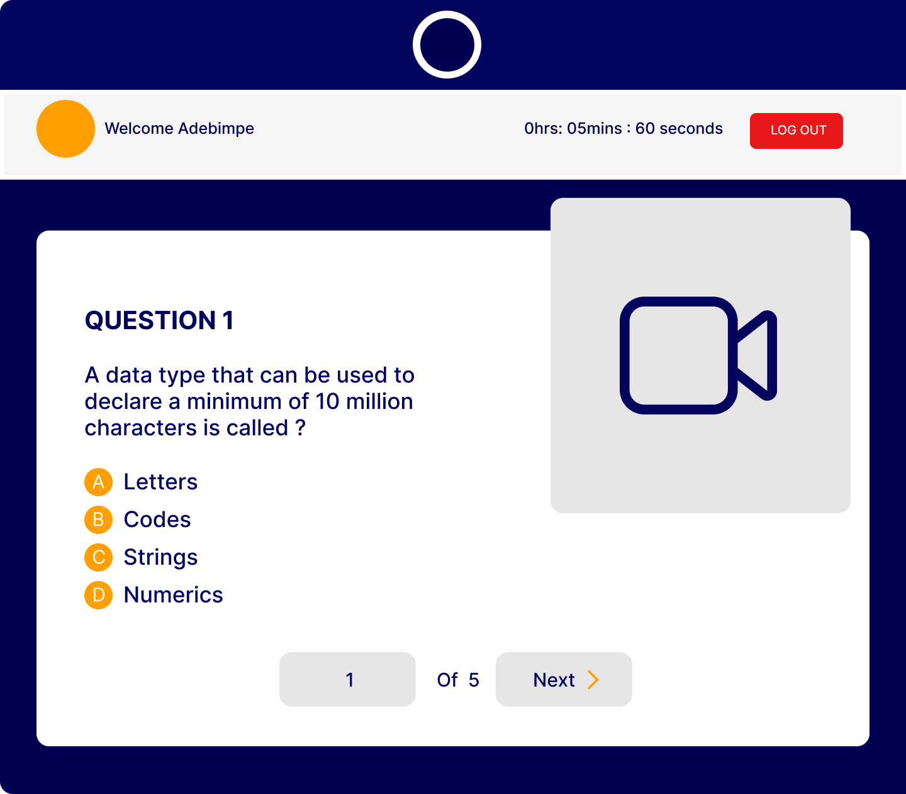

# SDProctor

A Exam proctoring website bootstrapped with [Create React App](https://github.com/facebook/create-react-app).

## Table of contents

- [Overview](#overview)
  - [The challenge](#the-challenge)
  - [Screenshot](#screenshot)
  - [Links](#links)
- [My process](#my-process)
  - [Built with](#built-with)
  - [What I learned](#what-i-learned)
  - [Useful resources](#useful-resources)

## Overview

### The challenge

Users should be able to:

- Create an account and face capture
- Login and face validation
- Take exams
- Be monitored via camera when taking the exams (proctoring)
- Ensure that no one is impersonating
- Navigate to the cart page

### Screenshot




### Links

- Solution URL: (https://github.com/faozziyyah/sdproctor)
- Live Site URL: (coming up soon)

## My process
### Built with

- CSS
- [React](https://reactjs.org/) - React: JS library
- [React-webcam](https://github.com/mozmorris/react-webcam) - React Library
- [React-paginate](https://github.com/AdeleD/react-paginate) - React Library for pagination
- [Ant-design](https://ant.design/)

### What I learned

- React Authentication and Authorization
- Consuming backend and ML APIs

```React.js
useEffect(() => {
    const setupCamera = async () => {
      const video = videoRef.current;

      try {
        const stream = await navigator.mediaDevices.getUserMedia({ video: true });
        video.srcObject = stream;
      } catch (error) {
        console.error('Error accessing camera:', error);
      }
    };

    setupCamera();
  }, []);
```
```React.js
  const offset = currentPage * n;
  const paginatedData = questions.slice(offset, offset + n);

  const navigate = useNavigate()

  function logout () {
    localStorage.clear()
    navigate('/')
  }
```

### Useful resources

In the project directory, you can run:

### `npm install` 

then...

### `npm start`

Runs the app in the development mode.\
Open [http://localhost:3000](http://localhost:3000) to view it in your browser.

The page will reload when you make changes.\
You may also see any lint errors in the console.
